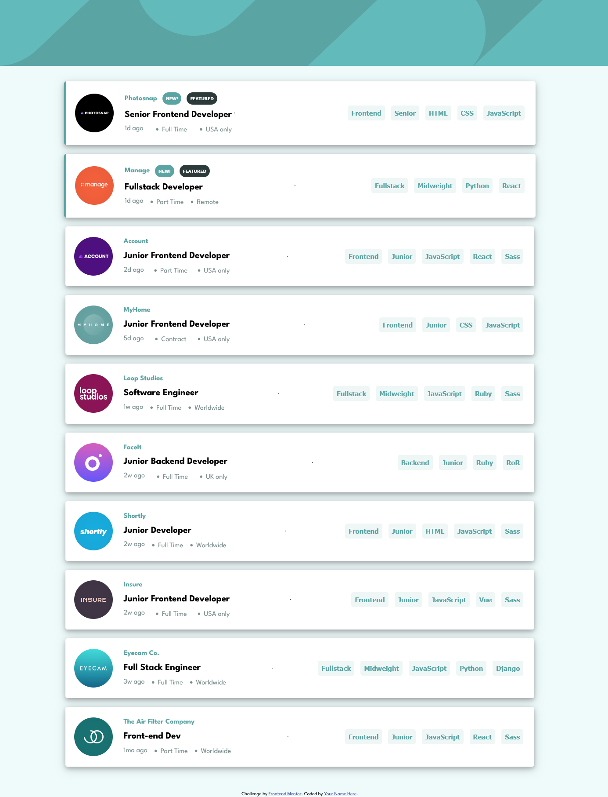
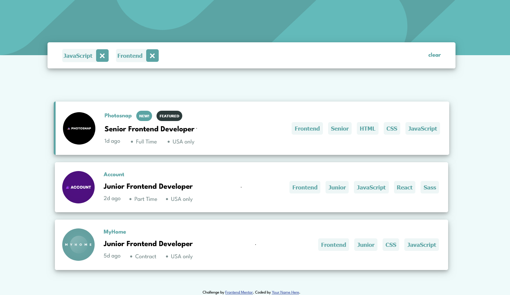

# Frontend Mentor - Job listings with filtering solution

This is a solution to the [Job listings with filtering challenge on Frontend Mentor](https://www.frontendmentor.io/challenges/job-listings-with-filtering-ivstIPCt). Frontend Mentor challenges help you improve your coding skills by building realistic projects. 

## Table of contents

- [Overview](#overview)
  - [The challenge](#the-challenge)
  - [Screenshot](#screenshot)
  - [Links](#links)
- [Author](#author)
- [Acknowledgments](#acknowledgments)

**Note: Delete this note and update the table of contents based on what sections you keep.**

## Overview

### The challenge

Users should be able to:

- View the optimal layout for the site depending on their device's screen size
- See hover states for all interactive elements on the page
- Filter job listings based on the categories

### Screenshot

  

### Links

- Solution URL: [Add solution URL here](https://github.com/0paziz/job-filter)
- Live Site URL: [Add live site URL here](https://0paziz.github.io/job-filter/)

## Author

- Website - [Aziz-portfolio](https://0paziz.github.io/Aziz-portfolio/index.html)
- Frontend Mentor - [@0paziz](https://www.frontendmentor.io/profile/@0paziz)
- Linkedin - [abdiaziz-omar](https://www.linkedin.com/in/abdiaziz-omar-876b06256/)

